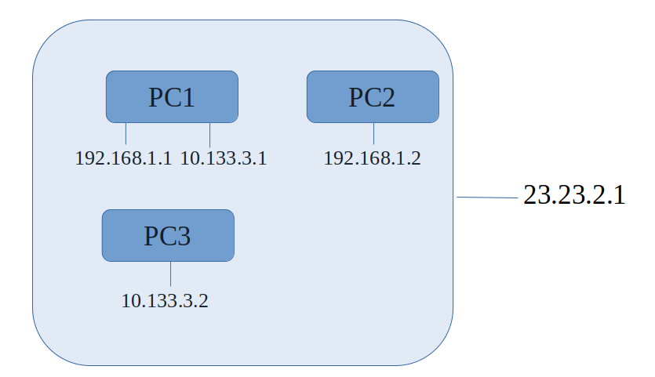

Translated from original article in chinese: [here](./1-0-preparation.cn.md)

## Introduction to WebRTC Terms

In WebRTC, there are many concepts that can create barriers to understanding for beginners. Without a general understanding of these concepts, even if they are not important, beginners may subconsciously perceive the subject as difficult. Here, I will describe these frequently encountered concepts in simple terms.

### SDP
SDP stands for Session Description Protocol. It includes whether to establish a data channel, a video stream, or an audio stream, as well as the format specifications for these streams. For example, the video codec could be H264 or VP8, and the audio codec could be OPUS, etc.

Below is an example of an SDP offer and the corresponding answer for establishing only a data channel.

#### Offer

```shell
v=0
o=- 8382788528297067006 2 IN IP4 127.0.0.1
s=-
t=0 0
a=group:BUNDLE 0
a=msid-semantic: WMS
m=application 9 UDP/DTLS/SCTP webrtc-datachannel
c=IN IP4 0.0.0.0
a=ice-ufrag:c+zu
a=ice-pwd:jvxc6prZIswRtLdfjJI1GJV4
a=ice-options:trickle
a=fingerprint:sha-256 13:5F:AB:21:80:9F:24:69:48:53:FC:39:5A:A4:5E:FB:31:4B:26:6F:8E:6A:36:01:8F:12:81:F3:60:D8:B9:B3
a=setup:actpass
a=mid:0
a=sctp-port:5000
a=max-message-size:262144
```

#### Answer

```shell
v=0
o=- 2411559430796177653 2 IN IP4 127.0.0.1
s=-
t=0 0
a=group:BUNDLE 0
a=msid-semantic: WMS
m=application 9 UDP/DTLS/SCTP webrtc-datachannel
c=IN IP4 0.0.0.0
b=AS:30
a=ice-ufrag:X4yB
a=ice-pwd:ik/QrqW5BOQwML43qbq9/mOo
a=ice-options:trickle
a=fingerprint:sha-256 C9:0D:5D:72:1F:A1:37:D4:06:7C:2C:A0:26:D1:ED:C9:EE:34:0D:EE:2E:05:D8:06:0B:43:66:0B:CC:2A:F0:12
a=setup:active
a=mid:0
a=sctp-port:5000
a=max-message-size:262144
```

Beginners do not need to worry about understanding every field in the SDP and its specific format. This is for two reasons: first, it's not the main point. Second, there's no need, as this is a standard format, which can be referred to in the RFC documents when needed.

Pay attention to a few key fields, such as `a=mid:0`, which indicates this is the first item in the SDP. If the SDP also needs to negotiate audio, then the audio section will be `a=mid:1`, and if there's video, the video section will be `a=mid:2`.

For example, `m=application 9 UDP/DTLS/SCTP webrtc-datachannel` indicates a data channel using the user-space SCTP protocol over DTLS-encrypted UDP.

The initiator first creates an SDP through the WebRTC interface, which is called an OFFER. Then, through some means (like a public network forwarding server), this SDP is sent to the responder, who responds to this OFFER with an SDP called an ANSWER.

More examples will be provided in the chapter on video streams.

### Candidate
As the name suggests, a candidate refers to a potential IP address for establishing a network connection.



In the diagram above, there are three PCs in a local area network with two sub-networks. The public IP of this local network is 23.23.2.1.

During the connection setup process, WebRTC collects candidates from both parties. Taking the example of establishing a connection between PC1 and PC2, and assuming the socket ports created by PC1 and PC2 are both 8888:

PC1 and PC2 will collect their own candidates, starting with their local network addresses. For

 PC1, it's 192.168.1.1:8888/10.133.3.1:8888, and for PC2, it's 192.168.1.2:8888.

After collecting a candidate, PC1 sends it to PC2 through some means (like a public network forwarding server), and PC2 does the same.

After collecting local network addresses, they collect public network addresses. WebRTC uses the STUN protocol for this. Simply put, PC1 sends a UDP packet to a STUN server on the public network. The STUN server then informs PC1 of the public IP and port (let's say 9999) from which PC1's UDP packet originated. Thus, PC1 acquires its external candidate: 23.23.2.1:9999.

Then, PC1 and PC2 announce their external candidates to each other.

In this example, since PC1 and PC2 are in the same local network, when PC1 gets PC2's local network candidate (192.168.1.2:8888), PC1 tries to communicate with this address:

```shell
192.168.1.1:8888 ------> 192.168.1.2:8888    yes!
10.133.3.1:8888  ------> 192.168.1.2:8888    no!
```

Similarly, when PC2 gets PC1's local network candidate, it performs the same action. When both PC1 and PC2 are communicable, the P2P connection is established, forming a "connection".

Each time a new candidate from the other party is received, WebRTC performs the aforementioned connectivity test. If a "better" connection is later found (based on RTT or Round-Trip Time sorting of all connections), WebRTC may switch to it, but I won't delve into further details about this here.
