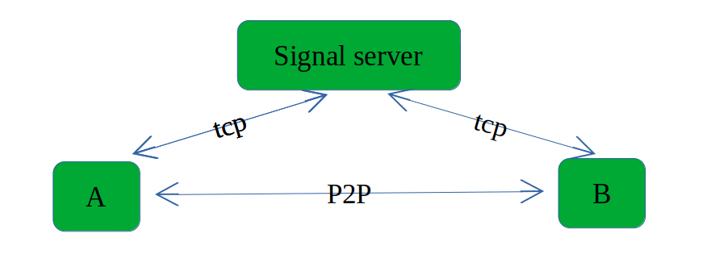

Translated from original article in chinese: [here](./1-1-datachannel.cn.md)

### WebRTC Data Channel

In WebRTC, in addition to transmitting audio and video, it's also possible to transfer ordinary data through "datachannel", such as binary protocols.

Besides introducing datachannel, the focus of this chapter is to describe the process of "establishing a connection" in WebRTC, illustrated with pseudocode.

For ease of explanation, let's assume two users, A and B, wish to interconnect using WebRTC, with A initiating the connection request. There are no audio or video streams, only a data channel is established.

### Signaling Server

WebRTC is a peer-to-peer communication technology aimed at establishing communication between two WebRTC clients in different networks. Before a P2P connection is established, A knows nothing about B.

WebRTC relies on a third-party service, accessible to both A and B, to help exchange information between them. This third-party service is known as the signaling server.

WebRTC does not standardize the signaling server; users are free to implement it. However, signaling servers typically use the WebSocket protocol for connecting with browsers (JavaScript).

The structure is as follows:



### PeerConnection

A peerconnection can be created as follows:

```c++
auto factory = new PeerConnectionFacotry(params);
auto peer_connetion = factory->create_peer_connection(params);
```

Given that WebRTC is a large modern C++ project, it naturally employs certain design patterns for code management, with the factory pattern pervading the entire WebRTC source code.

Among all classes and interfaces provided to users by WebRTC, PeerConnection is the most critical class.

Create a DataChannel using PeerConnection, and register an Observer for this DataChannel:

```c++
auto data_channel = peer_connection.CreateDataChannel("data");      //line 1
auto observer = new Observer(); 
data_channel.RegisterObserver(observer);                            //line 2
peer_conection.RegisterObserver(observer);

class Observer {
public:
    void OnSuccess(SessionDescriptionInterface* sdp) {
        peer_connection.SetLocalDescription(observer, sdp);       //line3
        signal_server.send_to("B", sdp); //Inform the remote side of the local sdp through the signaling server
    }
    void OnStateChange() {
        if(data_channel.state() == DataState::kOpen) {
            DataBuffer buf("hello, I'm A!");
            data_channel->send(buf);
        }
    }
}
```

When we execute line 1, the peerconnection knows that it needs to create a datachannel and writes "datachannel" in the offer during the creation of the Offer.

```C++
peer_connection.CreateOffer(observer, options); //Write "datachannel" in the offer
```

After WebRTC creates the offer, it will call back Observer.OnSuccess(sdp).

In this callback, users execute SetLocalDescription(sdp), officially making this sdp the "local Description," and sending this sdp to the remote side through the signaling server.

Ignoring the signaling server forwarding process, the remote side B also needs to create a peerconnection. Upon receiving the SDP from A, B uses this sdp as the "remote Description" and responds to A with an Answer.

Pseudocode is as follows:

```c++
auto factory = new PeerConnectionFacotry(params);
auto peer_connetion = factory->create_peer_connection(params);

void OnRemoteSdp(webrtc::SessionDescriptionInterface* sdp) {   #line1
    peer_connection.SetRemoteDescription(observer, sdp);       #line2
    peer_connection.CreateAnswer(observer, options);           #line3
} 

class Observer {
public:
    void OnSuccess(SessionDescriptionInterface* sdp) {
        peer_connection.SetLocalDescription(observer, sdp);
        signal_server.send_to("A", sdp); //Inform the remote side of the local sdp through the signaling server
    }
    //Callback after the data channel with A is opened
    void OnDataChannel(rtc::scoped_refptr<DataChannelInterface> data_channel) {
        data_channel_ = data_channel;
        data_channel_->RegisterObserver(this);
    }
    void OnStateChange() {
        if(data_channel_->state() == DataState::kOpen) {
            DataBuffer buf("hello, I'm B!");
            data_channel->send(buf);
        }
    }
private:
    rtc::scoped_refptr<DataChannelInterface> data_channel_ = nullptr;
}
```

Assuming B receives a message from the signaling server (A's offer), it will call line 1. By line 3, it creates the corresponding Answer. Similarly, when this sdp (answer) is created, WebRTC will callback observer.OnSuccess(sdp).

In this callback, officially make this sdp B's "local description" and forward this sdp to A through the signaling server.

When A receives the message from the signaling server, it uses the sdp sent by B

 as the "remote description".

```C++
void OnRemoteSdp(webrtc::SessionDescriptionInterface* sdp) {   #line1
    peer_connection.SetRemoteDescription(observer, sdp);       #line2
} 

```

Up to this point, the offer/answer interaction is complete. Next, we'll introduce the candidate.

When the application layer calls SetXXXDescription(), WebRTC begins collecting "**candidate addresses**".

#### Candidate (Candidate Address)

Host A under a local network has two network devices: Ethernet and 802.11 (Wi-Fi), with IPs 192.168.1.2/10.133.1.2, and its public network address is 200.100.50.1. Theoretically, host A has three UDP candidates, which are the three addresses mentioned. A candidate printed as a string looks like this:

``` shell
"candidate":"candidate:1779684516 1 udp 2122260223 192.168.29.185 56370 typ host
generation 0 ufrag 7XGL network-id 1","sdpClientType":"cpp",
"sdpMLineIndex":0,"sdpMid":"0","type":"candidates"
```

type=host indicates it's a local candidate, with IP 192.168.29.185.

Whenever a candidate is collected, WebRTC calls back OnIceCandidate, and at this time, the application layer needs to send this candidate to the remote side:

```c++
class Observer {
public:
    void OnIceCandidate(const webrtc::IceCandidateInterface* candidate) {
        signal_server.send_to("B", candidate); //Inform the remote side of our candidate through the signaling server
    }
```

When one side receives a candidate from the remote side, it needs to inform WebRTC:

```c++
auto peer_connetion = webrtc::PeerConnectionInterface();
class B {
    void on_recv_candidate(const webrtc::IceCandidateInterface* candidate) {
        peer_connection.AddIceCandidate(candidate);
    }
}
```

Subsequently, WebRTC matches local and remote candidates, creating virtual connections (**connections**).

#### Connection

A host A in a local network has only one network device, with a local IP of 192.168.1.2 and an external network address of 123.1.1.2.

Another host B in a different local network has only one network device, with a local IP of 10.133.1.2 and an external network address of 200.1.1.2.

When B's two candidates (local and external) are sent to A, A creates the following **connections**:

* 192.168.1.1 <-> 10.133.1.2
* 192.168.1.1 <-> 200.1.1.2

**Connection** is a virtual "connection" as a potentially connectable candidate.

WebRTC performs connectivity testing for all connections, similar to "ping". If they can "ping" through, it means the network is communicable. WebRTC then sorts all "connections" and selects the best one (with the shortest RTT) for the final media transmission.

### Datachannel Callbacks

After this, the DTLS handshake occurs, followed by the user-space SCTP protocol handshake, and the data channel is established.

For the side that actively creates the datachannel (A), WebRTC informs the user through the OnStateChange(state) callback.

For B, WebRTC informs the user through the OnDataChannel(channel) callback.


### Runnable C++ Example

In src/datachannel/main.cpp, I created two peerconnections, acting as the initiator and responder.

The example's main purpose is to demonstrate the WebRTC interaction process, so the action of forwarding by the signaling server is omitted, and the other side directly uses the sdp and candidate:

```C++
    virtual void OnSuccess(webrtc::SessionDescriptionInterface* desc) override {
        peer_connection_->SetLocalDescription(DummySetSessionDescriptionObserver::Create(), desc);
        
        //Need to convert sdp to a string for forwarding by the signaling server
        std::string sdp_str;
        desc->ToString(&sdp_str);
        /* sending sdp to remote...
         * ----------------------------------------> 1 ms
         * ----------------------------------------> 2 ms
         * ....
         * ----------------------------------------> 1/2 rtt
         */
        //The receiver needs to convert the string back to sdp
        auto sdp_cp = webrtc::CreateSessionDescription(desc->GetType(), sdp_str, nullptr);
        other_->received_sdp(sdp_cp.release());
    }
```

Although A and B are in the same process, they are still normal, independent WebRTC clients. Hopefully, this won't confuse the reader.

This concludes the process of a normal WebRTC connection.

**Complete Source Code**

https://github.com/MemeTao/webrtc-native-samples/blob/master/src/datachannel/main.cpp
