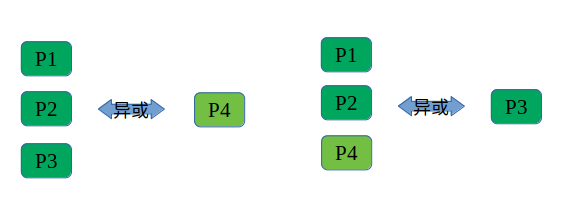
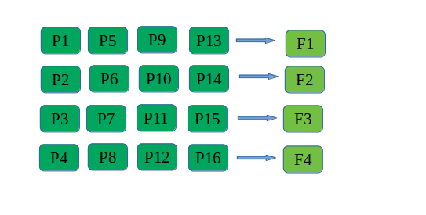

Translated from oroginal article in chinese: [here](./fec_generator.cn.md)

## WebRTC FEC Mechanism

This section mainly introduces the principle of FEC (Forward Error Correction) in WebRTC and its general process.

### Principle of FEC

FEC, meaning "Forward Error Correction", is a method of recovering from errors through certain redundant information.



In the diagram above, the sender generates a fourth packet by XOR-ing three packets and sends all four packets to the receiver. If one of these four packets is lost during this process, the lost packet can still be recovered based on the remaining three packets.

In the example above, the redundancy rate is 33%, meaning that one redundant packet is generated for every three packets. If the packet loss rate is less than 25% (one in four packets lost), FEC can be effective.

### Implementation of FEC in WebRTC

WebRTC primarily relies on retransmissions to handle packet loss. When RTT (Round Trip Time) is greater than 20ms and there is packet loss, both FEC and retransmissions are used to combat packet loss.

WebRTC implements FEC through two classes: FecController and FecGenerator. The former decides the redundancy rate based on the current RTT and packet loss rate, while the latter uses the redundancy rate to produce redundant packets based on video data input from the application layer. The code can be found in `modules/video_coding/fec_controller_default.cc` and `modules/rtp_rtcp/source/flexfec_sender.cc`.

#### Calculation of Redundancy Rate

The calculation is complex and can be referenced [here](https://www.jianshu.com/p/7fb9d640a998 "Calculation of Redundancy Rate").

The result falls within the range of [20%, 50%].

#### Generation of Redundant Packets

After an RTP packet is formed from a video frame, several RTP media packets are sent to FecGenerator. Usually, FecGenerator performs FEC for each video frame, generating redundant packets. When the number of media packets is less than or equal to 12, a fixed lookup table method determines the grouping. If more than 12, a modulus operation is used for grouping.

#### Determining Grouping by Lookup Table

When the number of media packets is less than or equal to 12, WebRTC uses two built-in static mask tables to determine the grouping: the "Random Packet Loss Table" and the "Burst Packet Loss Table".

The structure of the table is as follows:
```c++
#define kMaskBursty10_7 \
  0x30, 0x00, \
  0x18, 0x00, \
  0x0c, 0x00, \
  0x07, 0x00, \
  0x81, 0x40, \
  0xc0, 0x80, \
  0x60, 0x40
```

This example is the 7th item of the 10th table in the "Burst Packet Loss Table". When there are 10 media packets and 7 redundant packets, WebRTC uses this table.

* 0x30,0x00 -> 0011 0000 0000 0000, the 1st redundant packet is generated by XOR-ing the 3rd and 4th media packets
* 0x18,0x00 -> 0001 1000 0000 0000, the 2nd redundant packet is generated by XOR-ing the 4th and 5th media packets
* ....
* 0x60,0x40 -> 0110 0000 0100 0000, the 7th redundant packet is generated by XOR-ing the 2nd, 3rd, and 10th media packets

```c++
#define kMaskRandom6_2 \
  0xa8, 0x00, \
  0xd4, 0x00
```

This example is the 2nd item of the 6th table in the "Random Packet Loss Table". When there are 6 media packets and 2 redundant packets, WebRTC uses this table.

* 0xa8,0x00 -> 1010 1000 0000 0000, the 1st redundant packet is generated by XOR-ing the 1st, 3rd, and 5th media packets
* 0xd4,0x00 -> 1101 0100 0000 0000, the 2nd redundant packet is generated by XOR-ing the 1st, 2nd, 4th, and 6th media packets

**Currently, WebRTC (as of M83) still does not implement how to distinguish between random and burst packet loss and defaults to the random packet loss mode.**

#### Determining Grouping by Modulus

When the number of

 media packets exceeds 12, WebRTC uses a simple modulus method to determine the grouping.



In the diagram above, when there are 16 media packets and the redundancy rate is 25%, 4 redundant packets are needed.

In an ideal scenario, suppose these 20 RTP packets lose packets 1, 2, 3, and 4, they can be recovered through FEC.