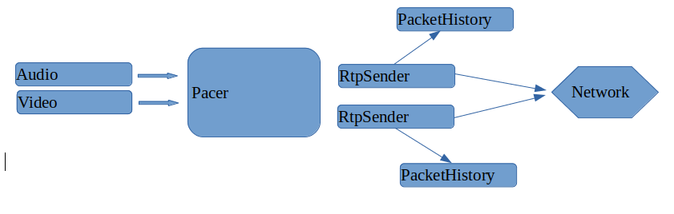
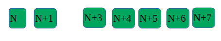

Translated from original article in chinese: [here](./packets%20retransmition.cn.md)

## WebRTC Network Transmission - Packet Retransmission

This section primarily discusses the process of packet sending in WebRTC and how to handle retransmission requests.

### Sending Packets

In WebRTC, there are two main sources of packet sending: audio and video streams. When there is data in the "stream," the "send" interface is invoked. After RTP packaging, all RTP packets are placed in the Pacer's "priority queue". The Pacer manages these packets uniformly and decides when to send each packet.

The Pacer retrieves several RTP packets from the queue each time. It identifies the "Sender" of each packet by the SSRC in the packet header and sends the packet to the network through this Sender. Each "Sender" has a "buffer (PacketHistory)" for storing "potentially retransmittable sent data." The **default length of this buffer is 600**.

### Receiving Packets 

The WebRTC receiver determines whether an RTP packet is audio or video based on the SSRC and PayloadType fields in the packet header and passes the packet to the corresponding "receiver stream." Taking video as an example, the VideoReceiver maintains a PacketBuffer to store "arrived but incomplete" video frames. There is also a module (Nack Module) specifically responsible for "sending retransmission requests."

### Nack Module

The Nack module has two criteria for determining packet loss, which must be satisfied simultaneously:

* Packet Interval 
* Time Difference

"Packet Interval" refers to the distance between packet sequence numbers. Suppose the packet interval is 5, and a Nack request will be triggered in the following situation:

In the diagram, packet N+2 has not arrived by the time packet N+7 is received.

In the Nack module, this packet interval is a best estimate obtained by the Nack module **statistically analyzing packet disorder over a past period** using a "histogram." This is not elaborated further here.

"Time Difference" refers to the time difference between the receipt of consecutive packets. The default is 0ms (always enabled), but it can be configured. Suppose the "interval" is 20ms, and if 21ms have passed since receiving packet N+1 when N+7 is received, then the condition for sending a Nack is met.

### Sender's Response to Receiving a Nack Message

Upon receiving a NACK message, the sender locates the corresponding "RtpSender" based on the SSRC in the RTCP header and informs it of the sequence numbers needing retransmission mentioned in the NACK message. The RtpSender searches the PacketHistory for the corresponding RTP packets. Retransmission may fail for several reasons:

* The corresponding RTP packet is not found, possibly because the buffer has been updated.
* Retransmission is too frequent: the time since the last sending of the RTP packet is less than one RTT.
* The bitrate currently used for sending retransmission packets is too high.

Once the RTP packet to be retransmitted is found and meets the retransmission criteria, the RtpSender will reinsert this RTP packet into the Pacer for participation in the next round of sending.

### Retransmitted Packet Loss Again

After sending a retransmission request, if the retransmitted packet still does not arrive within an RTT interval, the Nack module will send a second retransmission request, retrying up to 10 times.