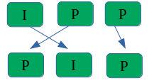

Translated from oroginal article in chinese: [here](./request_i_frame.cn.md)

## WebRTC Network Transmission - Keyframe Request

WebRTC requests keyframes (I-frames) in multiple scenarios. This section focuses on keyframe requests due to "packet loss."

### Number of Packets Pending Retransmission Exceeds the Limit (1000)

As shown in the diagram above, packets numbered 3-1001 are all lost. In this case, the Nack module will clear all pending retransmission sequence numbers and request a keyframe.

### Excessive Number of Incomplete Video Frames

Video RTP packets wait in the PacketBuffer for frame assembly. The PacketBuffer has a limited length (default maximum value is 2048). When this limit is reached, the current Buffer is cleared, and a keyframe is requested.

### P-Frame Arrives Before the First I-Frame

As illustrated above, the order of packets sent from the sender is I->P->P. Due to network packet loss, if a P-frame arrives before the I-frame, this directly triggers a keyframe request.

### Long Duration Without Decodable Video Frames

The WebRTC receiver has a decoding thread continuously waiting for decodable video frames. If no video frame is obtained for "a certain period," it will keep requesting keyframes.

This "certain period" is defined as follows:

* A keyframe is requested, but no keyframe is received within 200ms.
* No regular frames are received within 3000ms.